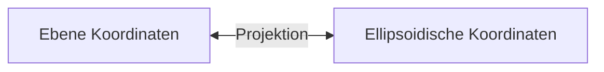
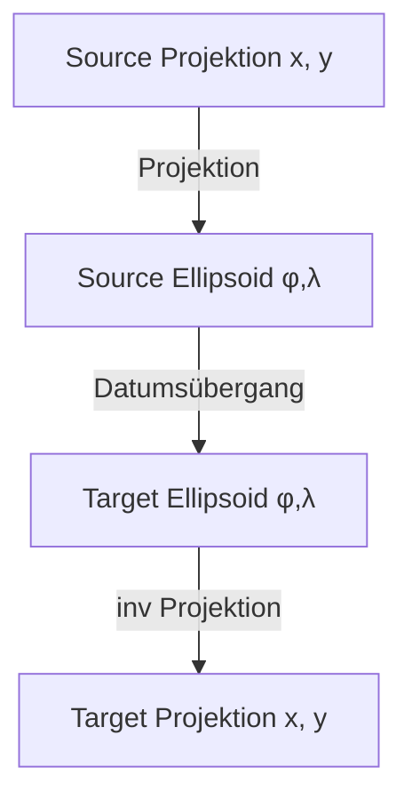
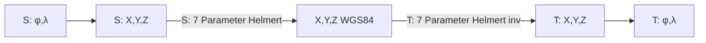
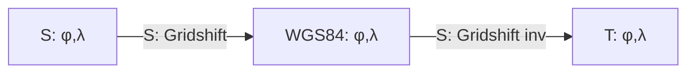
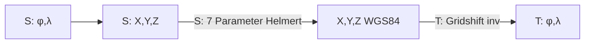

# Modifikationen zum Original Projekt

Im original Projekt gab noch ein Problem Transformation nach WebMercator. Dabei ging es um 
die Interpretation von ``+nadgrids=@null``. Zu Behebung des Problems wurden in meiner 
Implementierung von Version 1.x einige Änderungen vorgenommen.

Diese Änderungen können unter **Modifications** im letzten Branch von Version 1.x ``v1`` 
nachgelesen werden.

Nach einer erneuten Überarbeitung der Transformations Logik konnte auf einige dieser Änderungen 
verzichtet werden. Zum Beispiels ist der ``DatumTransformType`` ``NoDatum`` nicht mehr notwendig.

In dieser Beschreibung sollte gezeigt werden, wie die Projektslogik funktioniert und 
warum es zu Abweichungen der Ergebnisse zu alten ``proj4`` Libraries im Sub-Millimeter Bereich kommen 
kann.

> **_NOTE:_** Mit der Beschreibung und Änderungen zum original Projekt möchte ich die Arbeit der ursprünglichen Entwickler nicht kritisiern. Auch wenn einige Fehler passiert sind wurde hervorragende Arbeit geleistet. Auch ich nehme nicht an, dass die von mir vorgenommen Änderungen frei von Fehler sind.

## Begriffserklärung und Theorie

In Punkt auf der Erdoberfläche kann durch Koordinaten beschreiben werden. Es gibt unterschiedliche 
Koordinatensysteme in denen dies geschehen kann.
Bei einer Transformation werden Koordinaten von einem Koordinaten System in ein anderes 
Koordinaten System transformiert.

* **Ebene Koordinaten System**: Für lokale Bereiche wird die Erde in eine Ebene projeziert (zB durch 
  Zylinder, Kegel oder gnomonische Projektion). Diese Koordinatensystem besitzen verschiedene Eigenschaften wie Konformität (Winkeltreue) oder Flächentreue. Die ebenen Koordinaten werden meistens 
  mit ``x``, ``y`` beschrieben.
  Ebene Koordinaten System können auch einen globale Ausdehnen haben, beispielsweise die WebMercator 
  Projektion. Diese Projektionen weißen allerdings immer ab einem bestimmte Punkt großer Verzerrung auf,
  warum für geodätische Anwendungen meist die lokalen Ebenen Systeme verwendet werden.

* **Spherisch/Ellipsoidische Koordinaten:** Dabei handelt es sich auf Koordinaten die sich auf die
  Kugel bzw. auf das Ellipsoid beziehen und beziehen sich in der Regel auf den Abstand zum Äquator und 
  zu einem Null Meridian. Die Koordinaten werden in der Regel mit geographischer Breite (φ) und 
  geographischer Länge (λ) angegeben.
  Diese Koordinatensystem decken theoretisch die gesamte Erde ab. Allerdings sind Berechnungen auf 
  einem Ellipsoid ungleich komplexer als Berechnungen in der Ebene. Darum werden diese Koordinaten Systeme für geodätische Zwecke nicht verwendet sondern diese Koordinaten werden durch eine Projektion 
  in ein Ebenes Koordinatensystem überführt.



Es gibt verschiedene ellipsoidische Koordinatensysteme, da die Erde keine perfekte Kugel ist, 
sondern eine unregelmäßige Form hat, die als Geoid bezeichnet wird. Um diese Form zu approximieren, 
werden Ellipsoide mit unterschiedlichen Parametern (z. B. Halbachsen) verwendet, die je nach 
Region oder Anwendung optimiert sind. Diese Ellipsoide bilden die Grundlage für unterschiedliche
geodätische Referenzsysteme (Datums).

Der Grund für die Existenz verschiedener ellipsoidischer Koordinatensysteme liegt in der Notwendigkeit, regionale Gegebenheiten besser zu berücksichtigen. Ein globales Ellipsoid wie WGS84 ist für weltweite
Anwendungen geeignet, während regionale Ellipsoide wie das Bessel-Ellipsoid für spezifische Gebiete eine 
höhere Genauigkeit bieten können.

**Datumsübergang zwischen Systemen:**  

Ein Datumsübergang ist notwendig, wenn Koordinaten von einem geodätischen Referenzsystem (Datum) 
in ein anderes transformiert werden sollen. Dies ist häufig der Fall, wenn Daten aus unterschiedlichen
Quellen zusammengeführt werden oder wenn ein Wechsel von einem regionalen zu einem globalen System erfolgt.

Der Unterschied zwischen geozentrischen und nicht-geozentrischen Ellipsoiden liegt in der Position des 
Ellipsoids relativ zum Erdmittelpunkt. Geozentrische Systeme wie WGS84 haben ihr Zentrum im 
Erdmittelpunkt, während nicht-geozentrische Systeme wie das Potsdam-Datum eine Verschiebung aufweisen, um 
regionale Gegebenheiten besser zu modellieren.

**Methoden zur Beschreibung von Datumsübergängen:**

- **7-Parameter-Transformation:** Diese Methode verwendet drei Translationsparameter, drei 
  Rotationsparameter und einen Skalierungsfaktor, um die Beziehung zwischen zwei Datums zu beschreiben. 
  Sie ist besonders nützlich für großräumige Transformationen. Die Parameter beziehen sich auf räumliche 3D Koordinaten ``X``, ``Y``, ``Z``. Die geographischen Koordinaten (``φ``, ``λ``) müssen also 
  zusätzlich für den Datumsübergang räumliche 3D Koordinaten konvertiert werden.

  ```mermaid
    graph TD
        A[Ellipsoidisches Koord. φ,λ] <--> B[Nicht-Geoz. Koord. X,Y,Z]
        C[Geozentrische Koord. X,Y,T]
        D[Geozentrisches Koord. X,Y,Z] <--> E[Nicht-Geoz. Koord.. φ,λ] 
        B <-- 7 Parameters --> C 
        C <-- 7 Parameters inv. --> D 
  ```

  Auch wenn beide Ellipsoide geozentrisch sind (oder die idente Parameter haben) muss ein 
  Datumsübergang gemacht werden, sofern nicht auch die Ellipsoide die gleichen Parameter haben
  (große Halbachse und Exzentrizität). Dabei entfällt allerdings die 7 Parameter Transformation:

  ```mermaid
    graph LR
        A[Ellipsoidisches Koord. φ,λ]
        B[Räumliches Koord. X,Y,Z]
        C[Ellipsoidisches Koord. φ,λ]
        A <----> B
        B <----> C 
  ```


    
- **Grid-Shift-Transformation:** Diese Methode verwendet Gitterdateien, die lokale Unterschiede zwischen
  zwei Datums beschreiben. Sie ist besonders präzise für regionale Transformationen, da sie lokale 
  Verzerrungen berücksichtigt.

  ```mermaid
    graph LR
        C[Ellipsoidisches Koord. φ,λ] <-- Grid Shift --> D[Ellipsoidisches Koord. φ,λ]
  ```
    
Die Wahl der Methode hängt von der gewünschten Genauigkeit und dem verfügbaren Datenmaterial ab. Moderne 
Anwendungen bevorzugen oft Grid-Shift-Transformationen, da sie eine hohe Präzision bieten, insbesondere in 
Regionen mit komplexen geodätischen Gegebenheiten.

## Transformations Logik

Aus gehend von der oben beschrieben Theorie sind nun für eine Transformation folgende 
Voraussetzungen notwendig:

- beide Koordinatensysteme müssen eine Projektion aufweisen oder angeben, dass es sich bei den
  Koordinaten um geographische Koordinaten auf einem Ellipsoid handelt,
  Beispiele:
  
  - ``+proj=tmerc`` Transversale Mercator Projektion (winkeltreue Zylinderprojektion)
  - ``+proj=longlat`` Koordinaten sind geographische Koordinaten (Longitude φ, Latitude λ) in Grad

- optional zusätzliche Parameter, die die Projektion beschreiben wie ``+lat_0```,  ``+lon_0``, ``+k`` 
  etc.

- beide Koordinatensystem müssen sich auf ein Ellipsoid beziehen
  Beispiele:

  - ``+ellps=WGS84``, ``+ellps=bessel``, ... bekannte und definierte Ellipsoide
  - ``+a=6378137 +b=6378137`` angebe der großen und kleinen Halbachse des Ellipsoides in Metern,
    hier als Beispiel die Kugel für die WebMercator Projektion

- Angabe des Datums (Datumsübergangs), also der Lagerung des Ellipsoids in Bezug auf das Geozentrum.
  Beispiele:

  - ``+datum=WGS84`` Angabe eines definierten Datums 
  - ``+towgs84=577.326,90.129,463.919,5.137,1.474,5.297,2.4232`` Angabe der 7 Parameter für die Helmert
    Transformation
  - ``+nadgrids=AT_GIS_GRID_2021_09_28.gsb`` Angabe eine Grid Files für den Grid Shift
  - ``+nadgrids=@null`` Angabe eines optionalen Shifts (vorangestelltes ``@``), hier ein Null-Shift der 
    die geographischen Koordinaten einfach eins zu eins von einem Ellipsoid auf ein anders überführt.

> **_NOTE:_** ``+nadgrids=@null`` kommt beispielsweise bei der WebMercator Projektion zu Anwendung. Hier werden die Koordinaten aus dem WGS84 Ellipsoid einfach als Koordinaten auf der WebMercator Kugel übernommen. Den Datumsübergang (φ,λ) => (X,Y,Z) => (φ,λ) wird übersprungen. Für eigentlich Projektion wird dann aber die WebMercator Kugel verwendet: ``+proj=merc +a=6378137 +b=6378137 <other Parameters> +nadgrids=@null``

Damit ergibt sich für eine Transformation folgender Ablauf:



Der Datumsübergang ist abhängig von der des jeweiligen *Source* und *Target* Datum. 
Handelt es sich beispielsweise bei beiden um nicht geozentrische Ellipsoide, deren Lage durch eine 
7 Parameter Transformation definiert sind, wird der Datumsübergang folgendermaßen berechnet
(S: *Source*  T: *Target*)



 beispielsweise das Zielsystem auf WGS84 verkürzt sich der Ablauf folgendermaßen:

 ```mermaid
  graph LR
    B[S: φ,λ] --> C[S: X,Y,Z]
    D[X,Y,Z WGS84] --> F[T: φ,λ]
    C -- S: 7 Parameter Helmert --> D
```

Verwendet man Grid (``+nadgrids=...``) wird direkt zwischen Elllipsoiden transformiert:



> **_NOTE:_** Bei Gridshift wird immer davon ausgegangen, dass der Shift auf das geozentrische WGS84 Ellipsoid transformiert. Ist da nicht der Fall, kann eine nachträgliche Transformation an den eigentlichen Gridshift angehängt werden. So wird beispielsweise durch das österreichische GIS Grid auf das ETRS89 Datum mit dem Ellipsoid GRS80 transformiert. Um die Genauigkeit zu erhöhen kann über den ``+nadgrids`` Parameter eine Kette von Transformationen angeführt werden. Eine einfache Transformation kann mir mit ``ellps:EllipsoidName`` angegeben werden. Diese transformiert das Ergebnis des Gridshifts über das angeführte Ellipsoid nach WGS84. Beispiel: ``+nadgrids=AT_GIS_GRID_2021_09_28.gsb,ellps:GRS80``.

*Gridshifts* werden mit dem ``+nadgrids`` Parameter für eine Transformation definiert. Handelt es sich beispielsweise um eine ``gsb`` Datei, muss hier der Pfad der Datei angegeben werden. Wird nur der Filename 
des Grids angegeben, such die Library im ``share/proj`` Verzeichnis (relativ zum Pfad der ausgeführten Datei). Dieser Pfad kann über die statische Variable ``Proj4Net.Core.IO.Paths.PROJ_LIB`` auf einen beliebigen Pfad umgeleitet werden.

Die oben darstellten Datumsübergänge können, je nach den Eigenschaften des Ziel- und Quellkoordinatensystems kombiniert werden:

