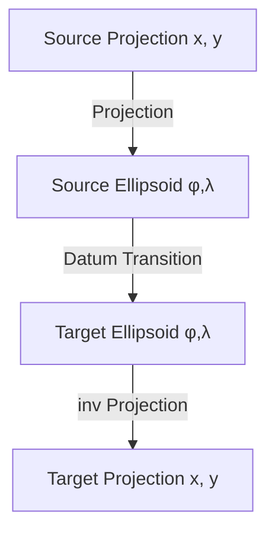
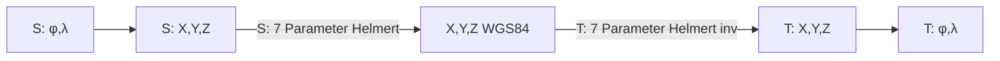
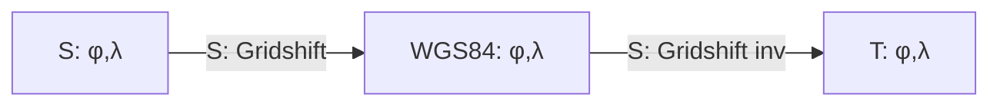
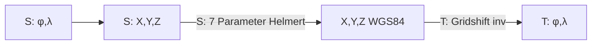

# Modifications to the Original Project

In the original project, there was an issue with the transformation to WebMercator. This was related to the interpretation of ``+nadgrids=@null``. To address the issue, several changes were made in my implementation of version 1.x.

These changes can be reviewed under **Modifications** in the last branch of version 1.x ``v1``.

After a subsequent revision of the transformation logic, some of these changes were no longer necessary. For example, the ``DatumTransformType`` ``NoDatum`` is no longer required.

This description aims to explain how the project logic works and why there may be deviations in results compared to older ``proj4`` libraries in the sub-millimeter range.

> **_NOTE:_** With this description and the changes to the original project, I do not intend to criticize the work of the original developers. Even though some errors occurred, excellent work was done. I also do not assume that the changes I made are free from errors or criticism.

## Terminology and Theory

A point on the Earth's surface can be described using coordinates. There are different coordinate systems in which this can be done. During a transformation, coordinates are converted from one coordinate system to another.

* **Planar Coordinate System**: For local areas, the Earth is projected onto a plane (e.g., using cylindrical, conical, or gnomonic projections). These coordinate systems have various properties such as conformality (angle preservation) or area preservation. Planar coordinates are usually described with ``x``, ``y``.  
  Planar coordinate systems can also have a global extent, such as the WebMercator projection. However, these projections always exhibit significant distortions beyond a certain point, which is why local planar systems are typically used for geodetic applications.

* **Spherical/Ellipsoidal Coordinates**: These refer to coordinates based on a sphere or ellipsoid and generally relate to the distance from the equator and a prime meridian. The coordinates are typically given as geographic latitude (``φ``) and longitude (``λ``).  
  These coordinate systems theoretically cover the entire Earth. However, calculations on an ellipsoid are significantly more complex than those on a plane. Therefore, these coordinate systems are not used for geodetic purposes but are instead projected into a planar coordinate system.


There are various ellipsoidal coordinate systems because the Earth is not a perfect sphere but an irregular shape known as a geoid. To approximate this shape, ellipsoids with different parameters (e.g., semi-major axes) are used, optimized for specific regions or applications. These ellipsoids form the basis for different geodetic reference systems (datums).

The existence of different ellipsoidal coordinate systems is due to the need to better account for regional conditions. A global ellipsoid like WGS84 is suitable for worldwide applications, while regional ellipsoids like the Bessel ellipsoid can provide higher accuracy for specific areas.

**Datum Transition Between Systems:**  

A datum transition is necessary when coordinates need to be transformed from one geodetic reference system (datum) to another. This often occurs when combining data from different sources or transitioning from a regional to a global system.

The difference between geocentric and non-geocentric ellipsoids lies in the position of the ellipsoid relative to the Earth's center. Geocentric systems like WGS84 are centered at the Earth's center, while non-geocentric systems like the Potsdam Datum are shifted to better model regional conditions.

**Methods for Describing Datum Transitions:**

- **7-Parameter Transformation:** This method uses three translation parameters, three rotation parameters, and a scaling factor to describe the relationship between two datums. It is particularly useful for large-scale transformations. The parameters refer to spatial 3D coordinates ``X``, ``Y``, ``Z``. Geographic coordinates (``φ``, ``λ``) must therefore also be converted into spatial 3D coordinates for the datum transition.

  ```mermaid
    graph TD
        A[Ellipsoidal Coord. φ,λ] <--> B[Non-Geocentric Coord. X,Y,Z]
        C[Geocentric Coord. X,Y,Z]
        D[Geocentric Coord. X,Y,Z] <--> E[Non-Geocentric Coord. φ,λ] 
        B <-- 7 Parameters --> C 
        C <-- 7 Parameters inv. --> D 
  ```

  Even if both ellipsoids are geocentric (or have identical parameters), a datum transition is required unless the ellipsoids also share the same parameters (semi-major axis and eccentricity). In this case, the 7-parameter transformation is omitted:

  ```mermaid
    graph LR
        A[Ellipsoidal Coord. φ,λ]
        B[Spatial Coord. X,Y,Z]
        C[Ellipsoidal Coord. φ,λ]
        A <----> B
        B <----> C 
  ```

- **Grid-Shift Transformation:** This method uses grid files that describe local differences between two datums. It is particularly precise for regional transformations as it accounts for local distortions.

  ```mermaid
    graph LR
        C[Ellipsoidal Coord. φ,λ] <-- Grid Shift --> D[Ellipsoidal Coord. φ,λ]
  ```
    
The choice of method depends on the desired accuracy and the available data. Modern applications often prefer grid-shift transformations due to their high precision, especially in regions with complex geodetic conditions.

## Transformation Logic

Based on the theory described above, the following prerequisites are necessary for a transformation:

- Both coordinate systems must specify a projection or indicate that the coordinates are geographic coordinates on an ellipsoid.  
  Examples:
  
  - ``+proj=tmerc`` Transverse Mercator projection (conformal cylindrical projection)
  - ``+proj=longlat`` Coordinates are geographic coordinates (longitude φ, latitude λ) in degrees

- Optionally, additional parameters describing the projection, such as ``+lat_0``, ``+lon_0``, ``+k``, etc.

- Both coordinate systems must reference an ellipsoid.  
  Examples:

  - ``+ellps=WGS84``, ``+ellps=bessel``, ... known and defined ellipsoids
  - ``+a=6378137 +b=6378137`` Specification of the semi-major and semi-minor axes of the ellipsoid in meters,  
    here as an example, the sphere for the WebMercator projection

- Specification of the datum (datum transition), i.e., the positioning of the ellipsoid relative to the geocenter.  
  Examples:

  - ``+datum=WGS84`` Specification of a defined datum  
  - ``+towgs84=577.326,90.129,463.919,5.137,1.474,5.297,2.4232`` Specification of the 7 parameters for the Helmert transformation  
  - ``+nadgrids=AT_GIS_GRID_2021_09_28.gsb`` Specification of a grid file for the grid shift  
  - ``+nadgrids=@null`` Specification of an optional shift (prefixed with ``@``), here a null shift that simply transfers the geographic coordinates from one ellipsoid to another one-to-one.

> **_NOTE:_** ``+nadgrids=@null`` is used, for example, in the WebMercator projection. Here, the coordinates from the WGS84 ellipsoid are simply adopted as coordinates on the WebMercator sphere. The datum transition (φ,λ) => (X,Y,Z) => (φ,λ) is skipped. However, the WebMercator sphere is then used for the actual projection: ``+proj=merc +a=6378137 +b=6378137 <other Parameters> +nadgrids=@null``

This results in the following process for a transformation:



The datum transition depends on the respective *Source* and *Target* datum.  
For example, if both are non-geocentric ellipsoids whose positions are defined by a 7-parameter transformation, the datum transition is calculated as follows (S: *Source*  T: *Target*):



If the target system is WGS84, the process is simplified as follows:

 ```mermaid
  graph LR
    B[S: φ,λ] --> C[S: X,Y,Z]
    D[X,Y,Z WGS84] --> F[T: φ,λ]
    C -- S: 7 Parameter Helmert --> D
```

Using a grid (``+nadgrids=...``), the transformation occurs directly between ellipsoids:



> **_NOTE:_** With grid shifts, it is always assumed that the shift transforms to the geocentric WGS84 ellipsoid. If this is not the case, an additional transformation can be appended to the actual grid shift. For example, the Austrian GIS grid transforms to the ETRS89 datum with the GRS80 ellipsoid. To increase accuracy, a chain of transformations can be specified using the ``+nadgrids`` parameter. A simple transformation can be specified with ``ellps:EllipsoidName``, which transforms the result of the grid shift via the specified ellipsoid to WGS84. Example: ``+nadgrids=AT_GIS_GRID_2021_09_28.gsb,ellps:GRS80``.

*Gridshifts* are defined with the ``+nadgrids`` parameter for a transformation. For example, if it is a ``gsb`` file, the file path must be specified here. If only the filename of the grid is given, the library searches in the ``share/proj`` directory (relative to the path of the executed file). This path can be redirected to any path via the static variable ``Proj4Net.Core.IO.Paths.PROJ_LIB``.

The datum transitions described above can be combined depending on the properties of the source and target coordinate systems:



> **_NOTE:_** As mentioned above, the library always assumes that a grid shift always refers to WGS84, i.e., transforms to or from WGS84. This automatically resolves the original issue with ``+nadgrids=@null`` in WebMercator. As shown in the diagram above, the WGS84 coordinates are directly adopted as (``φ``,``λ``) coordinates on the WebMercator sphere. The following changes in the ``BasicCoordinateTransform`` class are responsible for this:

```csharp

// jugstalt
// gridshift always leads to WGS84, ETRS, ...?
_sourceGeoConv =
    sourceCRS.Datum.TransformType == Datum.Datum.DatumTransformType.GridShift  
    ? new GeocentricConverter(Datum.Datum.WGS84.Ellipsoid)
    : new GeocentricConverter(sourceCRS.Datum.Ellipsoid);

_targetGeoConv =
    targetCRS.Datum.TransformType == Datum.Datum.DatumTransformType.GridShift
    ? new GeocentricConverter(Datum.Datum.WGS84.Ellipsoid)
    : new GeocentricConverter(targetCRS.Datum.Ellipsoid);
```

## Accuracy and Compatibility

The calculations result in slightly different outcomes (in the sub-millimeter range) due to the transformation logic described above.

An example is the **NAD83 / BC Albers (EPSG:3005)** transformation:

``+proj=aea +lat_0=45 +lon_0=-126 +lat_1=50 +lat_2=58.5 +x_0=1000000 +y_0=0 +ellps=GRS80 +towgs84=0,0,0,0,0,0,0 +units=m +no_defs``

Previously, ``GRS80`` was not transformed to ``WGS84`` (via the spatial coordinate system).  
The reason was that the two systems ``GRS80`` and ``WGS84`` were considered identical. In the ``Datum`` class, the following code was used in the ``Equal()`` method:

```csharp
// false if ellipsoids are not (approximately) equal
if (_ellipsoid.EquatorRadius != _ellipsoid.EquatorRadius)
{
    if (Math.Abs(_ellipsoid.EccentricitySquared
         - datum._ellipsoid.EccentricitySquared) > ELLIPSOID_E2_TOLERANCE)
    {
        return false;
    }
}
```

In the first ``if`` statement, two identical values are compared (unintentional error). As a result, the two different ellipsoids are never recognized.

I changed this code as follows:

```csharp
// jugstalt
if (Math.Abs(_ellipsoid.EquatorRadius - datum.Ellipsoid.EquatorRadius) > ELLIPSOID_R_TOLERANCE ||
    Math.Abs(_ellipsoid.EccentricitySquared - datum._ellipsoid.EccentricitySquared) > ELLIPSOID_E2_TOLERANCE)
{
    return false;
}
```

Additionally, since the ``ELLIPSOID_E2_TOLERANCE`` was reduced, the library now detects a difference between ``GRS80`` and ``WGS84``. This results in different outcomes in the sub-millimeter range compared to existing ``proj4`` variants.

> **_NOTE:_** To avoid the transition from GRS80 to WGS84, one would need to specify ``+nadgrids=@null`` according to the projection logic.

Despite the changes, all existing tests pass without errors. However, the tolerance for the specified values (some of which come from older ``proj4`` implementations) had to be reduced:

```csharp
internal const double TOLERENCE_XY = 0.0005;  // 0.0001
```

> **_NOTE:_** The deviations are still less than 0.5mm (previously 0.1mm). The tests would also pass with an accuracy of 0.2mm, as the transition from GRS80 to WGS84 is very small. However, it should be noted that projections (``φ``,``λ`` => ``x``,``y``) are sometimes based on Taylor series, which are truncated after a certain term. The relevance of sub-millimeter accuracy for geodetic applications is therefore questionable ;)

To understand which steps are performed during a transformation, 
[Debugging](./debugging_en.md) can be used.